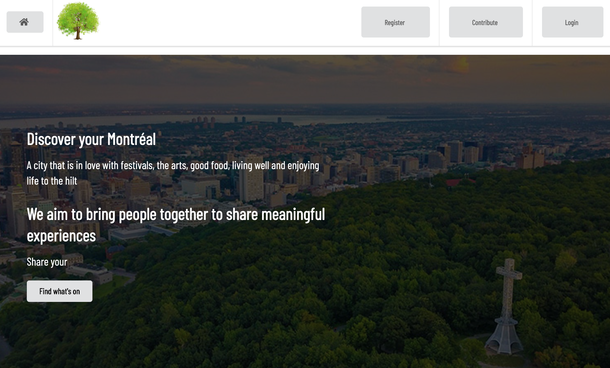
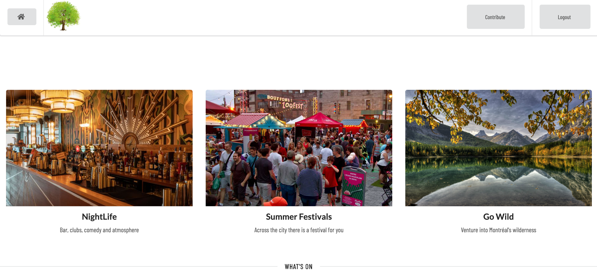
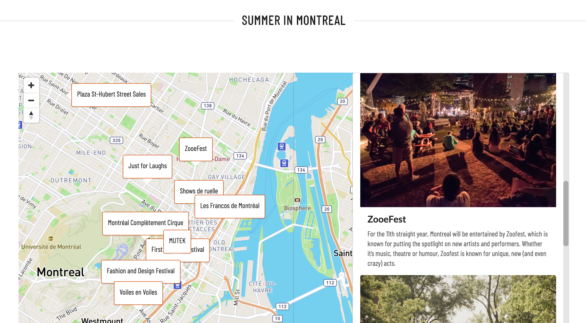
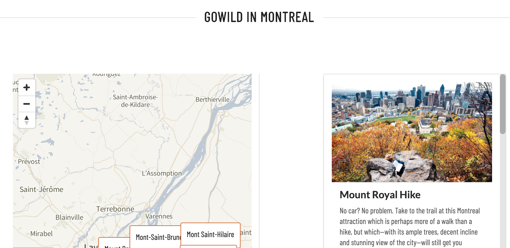
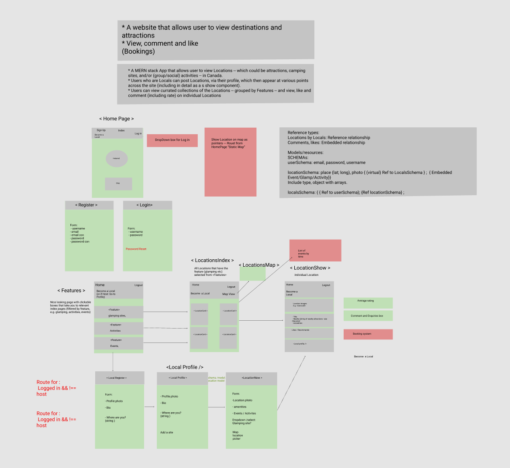

# React & Express | sei50-project III
A MERN App, creating APIs with a server-side JavaScript and noSQL database, incorporating MongoDB, Express, React, and Node.js plus Mongoose.

A team project over approx one week.

## Table of contents
* [General info](#general-info)
* [Screenshots](#screenshots)
* [Pre-Work](#pre-work)
* [Technologies](#technologies)
* [Setup](#setup)
* [Code Examples](#code-examples)
* [Features](#features)
* [Challenges and Wins](#challenges-and-wins)
* [Status](#status)

## General info
Our team choose to build a lifestyle application giving local tips about visiting Montréal, Canada.  Inspiration was drawn from sites such as wwoof.net and booking.com

## Screenshots
The landing page for the app is shown:


There are 3 main features: nightlife, summer and go-wild.  Visitors and locals (posting events) can allocate events to each of these different feature types.




Mapbox has different map styles, in the application each feature had a different styled map.  The go-wild style was based on mapbox 'Frank' inspired by Frank Lloyd Wright.



## Pre-Work

Figma was used during the design phase of the sei-project (software engineering immersive).   In figma the wireframe for the minimum viable product (MVP) was set out.



## Technologies
Front End:
- Axios
- Node-sass
- React
- React-geocode
- React-map-gl
- React-responsive-carousel
- React router dom
- Semantic-ui-css
- Semantic-ui-react
- Semantic-ui-react-scrollbar

Dev Tools:
- Heroku
- Git 
- Github
- VSCode
- Insomnia
- Eslint
- Google Chrome dev tools
- Figma

Image Processing and Management
- Cloudinary

Back End:
- Bcrypt
- Express
- Faker
- Jsonwebtoken
- Mongoose
- MongoDB

## Setup

Deployed with Heroku the React API webapp is hosted here:

[GA LDN sei-project-three](https://sei50-p3.herokuapp.com/) 

Use the following commands to run the development server:

- `mongod --dbpath ~/data/db` to run the primary daemon process for MongoDB 
- `npm run dev` on the backend side
- to view in a browser: localhost:3000

## Code Examples
Following code written by myself include accessing the React-geocode API to source the latitude and longitude of newly added events.  The search area was set to Canada.  Users are able to search for location by postcode or name.
```js
export async function geoCoord(coordInput){
  const ApiKey = process.env.REACT_APP_GOOGLE_MAPS_GEOCODING_API

  Geocode.setApiKey(ApiKey)
  Geocode.setLanguage('en')
  Geocode.setRegion('CA')

  const result = await Geocode.fromAddress(coordInput).then(
    response => {
      const { lat, lng } = response.results[0].geometry.location
      return { latitude: lat, longitude: lng } 
    },
    error => {
      console.error(error)
    }
  )
  return result
}
```
Location coordinates were stored in the database by calling the API and function locationCoordCreate:
```js
async function locationCoordCreate(req, res,next) {
  try {
    const location = await Location.findById(req.params.id)
    if (!location) throw new Error(notFound)
    const coord = { ...req.body, local: req.currentUser._Id }
    if (location.coords.length > 0) (location.coords.pop())
    location.coords.push(coord)
    await location.save()
    res.status(201).json(location)
  } catch (err){
    next(err)
  }
} 
```
For the database seed process, comments and locations were locally stored.  User profiles were available via the Faker Python package that generates fake data (`npm run seedexternal`) and also by a small set locally (`npm run seed`).  During the seed process users were assigned to locations and comments randomly.

```js
      const users = await User.create(userData)

      const locationWithUsers = locationData.map(location => {
        location.local = users[(Math.floor(Math.random() * (users.length - 1)))]._id
        return location
      })
      const locations = await Location.create(locationWithUsers)
      
      const commentWithUsers = commentData.map(comment => {
        comment.local = users[(Math.floor(Math.random() * (users.length - 1)))]._id
        return comment
      })
      for (let index = 0; index < commentWithUsers.length; index++){
        const random = Math.floor(Math.random() * (locations.length - 1))
        const location = await Location.findOne().skip(random)
        const locationById = await Location.findById(location._id)
        await locationById.comments.push(commentWithUsers[index])
        await locationById.save()
      }
```

Cloudinary is a SaaS and provides an API repository for image storage, shown is code from the ImageUpload.js component.  When an image is successfully posted in Cloudinary it will render:

```js
    {image ?
      <div style={{ width: '300px' }}>
        
      </div>
      :
      <>
        <label id='img-upload-label' className="label">{this.props.labelText || '(10mb max - please wait for the image to display)'}</label>
        <input
          className="input"
          type="file"
          onChange={this.handleUpload}
        />
      </>
    }
```

## Features
List of features ready and TODOs for future development
* The overall feature concept for the application adds appeal to the site - Discover Montréal | nightlife, summer & gowild
* The ability to add location coordinates via the React-GeoCode API and store in the db added greater user functionality
* Visitors are able to rate and comment on events
* Visitor and local users can register, login and create profiles and upload images
* TODO would include additional visitor and local features such as contacting those hosting events, scheduling and booking

## Challenges and Wins
* The first hurdle for my team was ... picking the team name 'Pistachio Glampers'  The initial plan was to create a glamping website (camping involving accommodation and facilities more luxurious than those associated with traditional camping).  We changed tack though and the app is based on locals providing tips about visiting Montréal, Canada.  The team name remained
* Working as a team, planning, git, creating and checking out branches, merging and pushing to GitHub
    ```shell
    ➜  sei-project-3 git:(development) gco -b coord
    Switched to a new branch 'coord'
    ➜  sei-project-3 git:(coord) 
    ```
* Features such as adding geo-coordinates, image uploads, updating profiles from a general user to a contributing local were enjoyable to resolve
* Focusing on the qualities of a successful team: listening, contributing, supporting, planning and the odd laugh - focusing on our goal was a win 

## Status
Project is: _no longer continue_ (GA software immersion course concluded)